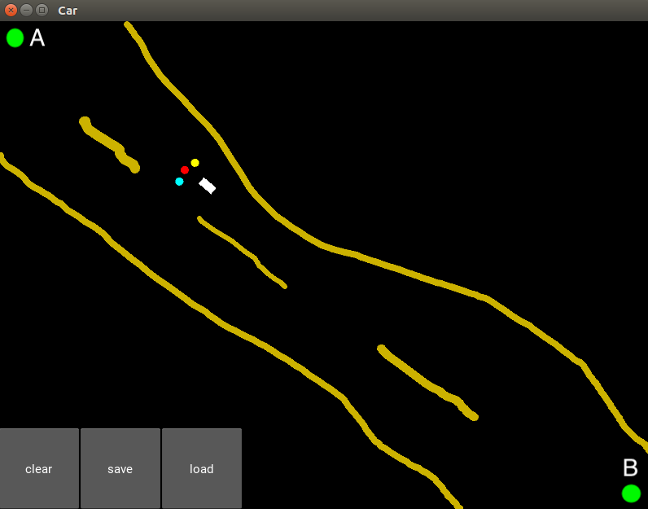
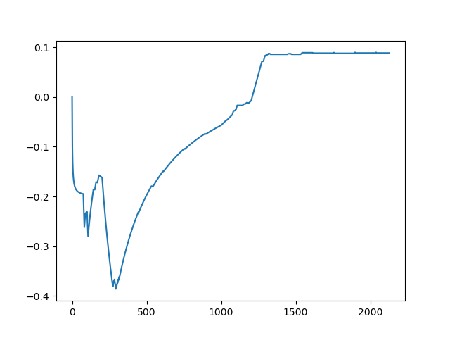
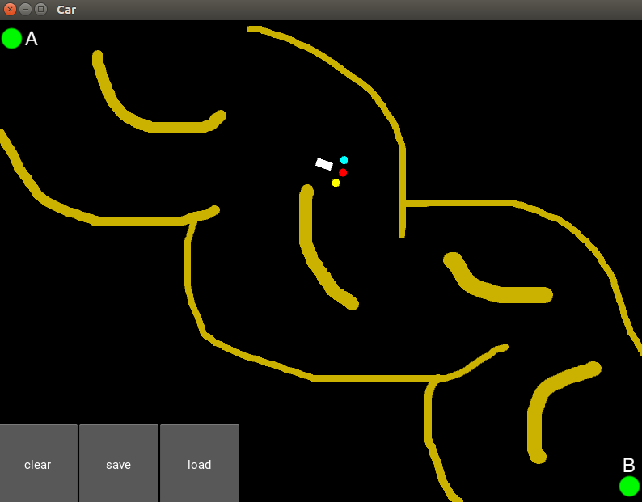
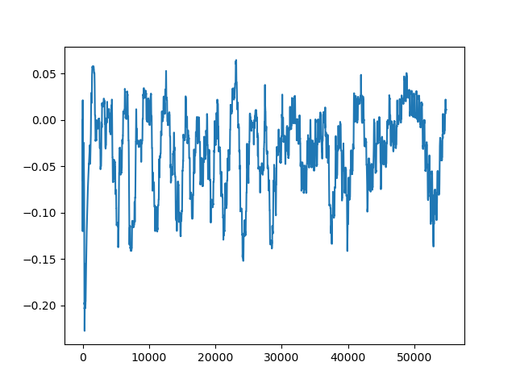

# Deep-Q-Learning-Self-Driving-Car
In this repository you can find a project for "[Artificial Intelligence A-Z™: Learn How To Build An AI](https://www.udemy.com/course/artificial-intelligence-az/)" course. In this project, I created a neural network to predict the action of a self-driving car in [kivy](https://kivy.org/#home) environment with Deep-Q Learning algorithm. 

### Requirements:
To run this you need to install two module first:

`conda install pytorch==0.3.1 -c pytorch`

`conda install -c conda-forge kivy`

### Example_1:

In this example, we aim to move the car to navigate between points A and B while avoid hitting the sand alongside the road.

 

### Example_2:

In this example we form a more complicated road shape for the car. In this case, as you can see the rewards during the learning process, learning how to navigate between point A and B is challenging fot the car! 

 

